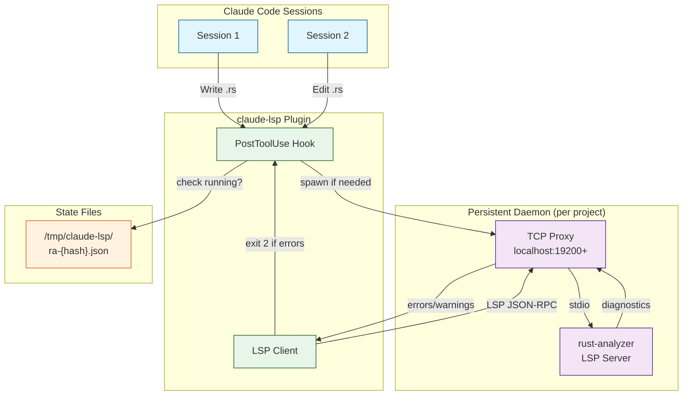

# claude-lsp

Fast Rust type checking for Claude Code via persistent rust-analyzer LSP daemon.

## Install

```bash
claude plugin marketplace add andrewgazelka/claude-lsp
claude plugin install claude-lsp
```

## How It Works

After writing/editing `.rs` files, this plugin queries a persistent rust-analyzer daemon for diagnostics. The daemon is shared across all Claude Code sessions working on the same project.



**Flow:**
1. Claude edits a `.rs` file → PostToolUse hook triggers
2. Hook checks `/tmp/claude-lsp/ra-{hash}.json` for running daemon
3. If no daemon, spawns rust-analyzer with TCP proxy (~5s startup)
4. LSP client queries daemon for diagnostics (~50ms when warm)
5. Errors returned to Claude (exit code 2) → Claude fixes them

- **First edit**: Spawns rust-analyzer daemon (~5s startup)
- **Subsequent edits**: Fast diagnostics (~50ms once warm)
- **Cross-session**: Daemon persists between Claude Code sessions

## Behavior

- **Errors**: Shown to Claude (exit code 2) - Claude will attempt to fix
- **Warnings**: Logged but non-blocking
- **Fallback**: Uses `rustfmt --check` if rust-analyzer unavailable

## Requirements

- `bun` (for running the hook)
- `rust-analyzer` (via PATH or nix)
